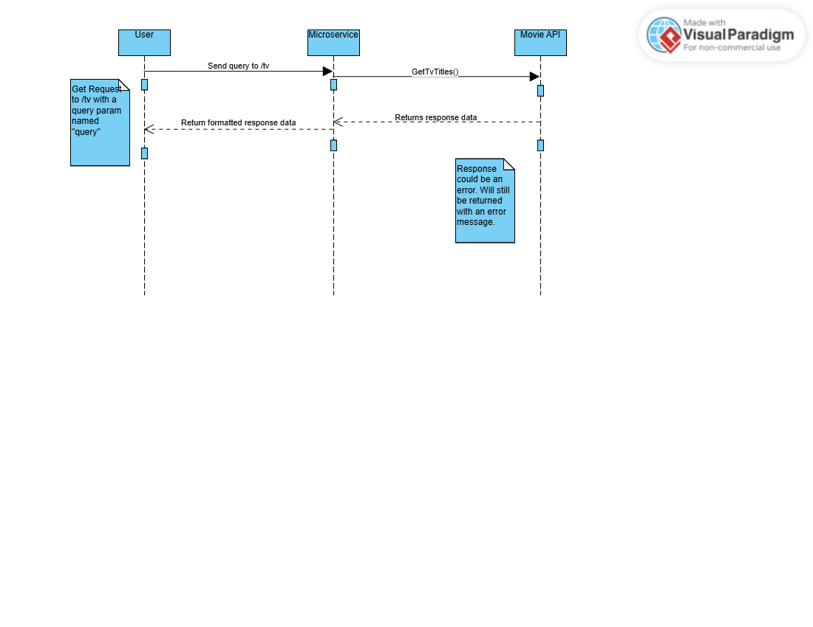

# Movie Search API

## Instructions

There is no need to install anything to use this service. You simply need to send an http GET request to the link at one of the endpoints along with a query param with your query.

### API URL

- `https://moviesearchdatabase-bedye6hmdkhmardn.centralus-01.azurewebsites.net`

### Endpoints

1. **/movie**
   - Will return a response with a list of movie titles matching the query and some additional data.
2. **/tv**
   - Will return a response with a list of tv titles matching the query and some additional data.
3. **/person**
   - Will return a response with a list of people matching the query and the titles they are known for.

## Example Requests

- `https://moviesearchdatabase-bedye6hmdkhmardn.centralus-01.azurewebsites.net/movie?query=batman`
- `https://moviesearchdatabase-bedye6hmdkhmardn.centralus-01.azurewebsites.net/tv?query=firefly`

## Response Types

1.  **/movie**
    `{
data {
results [
    {
        title,
        release_date,
        id,
        poster_path,
        overview,
        poster_path_full,
    },...
        ]
    }
}`
2.  **/tv**
    `{
data {
results [
    {
        name,
        first_air_date,
        id,
        poster_path,
        overview,
        poster_path_full,
    },...
        ]
    }
}`
3.  **/person**
    `{
data {
results [
            {
                name,
                known_for [
                    {
                        title,
                        release_date,
                        media_type,
                        id,
                        poster_path,
                        overview,
                        poster_path_full
                    },...
                ]
            },...
        ]
    }
}`

## UML

